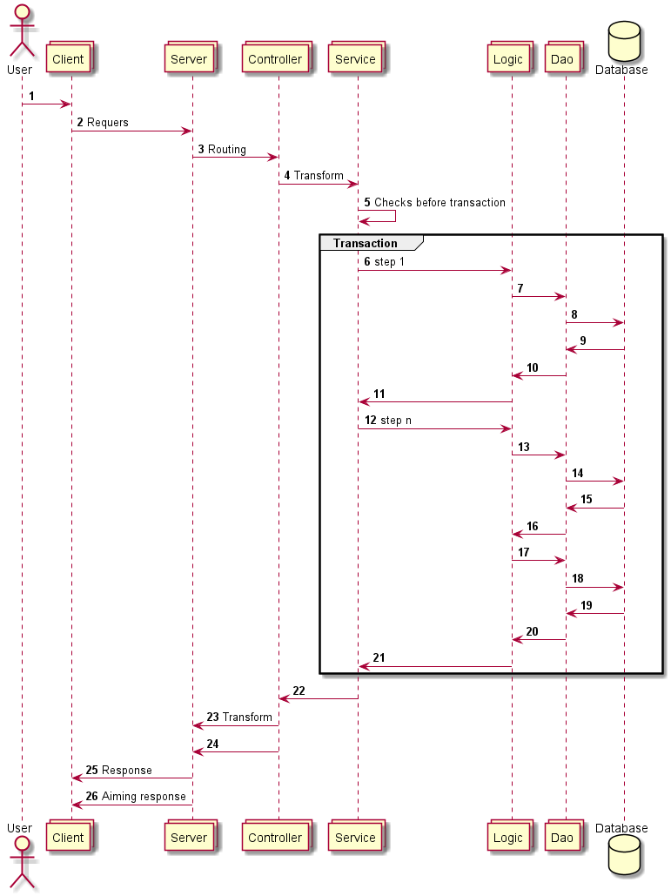

# Zemrow Messenger

<!-- TODO ссылки на readme на других языках -->
## Что такое Zemrow Messenger? 
<!--EN: What is Zemrow Messenger? -->

Веб приложение объединяющее функционал месенджера, создания и ведения задач, с возможностью автоматизации процессов.

## Перед началом
<!--EN: Prerequisites -->
На компьютере должны быть установлены 
- [Git](https://git-scm.com/downloads)
- [Java JDK 8 или выше](http://www.oracle.com/technetwork/java/javase/downloads/index.html)
- [Maven](http://maven.apache.org/download.cgi) 

## Как запустить 
<!--EN: Getting Started -->
- скачать исходники
```git clone https://github.com/a-polyakov/com.zemrow.messenger.git```
- запустить сервер
```mvn TODO```

<!--
TODO Аргументы:
TODO порт запуска WEB сервера как параметр
-->

## Технические детали
Клиентская часть реализована на [jQuery](https://jquery.com/).
За получение и обработку запросов отвечает [Undertow](http://undertow.io/).
Взаимодействие осуществляется по протоколу rest и websocket.
Данные хранятся в БД [PostgreSQL](https://www.postgresql.org/) 
<!--
TODO Что позволило легко кластеризовать приложение, получив при этом высокую производительность и надежность.
TODO Android и IOS приложение представляют из себя фоновый процесс получния уведомлений,
а при переходе в уведомление происходит открытие штатного браузера 
-->

## Диаграма взаимодействия компонентов

1. Пользователь взаимодействует с клиентским приложением (это может быть ПК, телефон или другое устройство с WEB браузером) 
у одного пользователя может быть несколько одновременно используемых подключений.
2. Клиентское приложение отправляет запрос на сервер (WebSocket).
3. Cервер получает запрос, анализирует и отправляет на соответствеющий контролер.
4. Контролер конвертирует данные и передает их в сервис.
5. Серсив выполняет необходимые ему действия (часть из которых может выполнить вне транзакции). 
6. Внутри транзакции сервис вызывать один или больше логических блоков.
7. Логический блок служат для повторного использования кода (без управления транзакциями, за это отвечает сервис).
8. Логический блок использует DAO для взаимодействия с хранилищем.
9. Передача ответа.
10. Передача ответа.
11. Передача ответа.
12. Контролеру может понадобится несколько манипуляций с хранилищем.
13. Запрос.
14. Запрос.
15. Ответ.
16. Ответ.
17. Логическому блоку тоже может понадобиться несколько манипуляций с хранилищем.
18. Запрос.
19. Ответ.
20. Ответ.
21. Ответ.
22. Сервис получает ответ и закрывает транзакцию, дополняет ответ областью видимости.
23. Контролер анализирует область видимости и определяет сервера которым необходимо отправить ответ.
24. Сервер который должен отправить ответ может быть не один.
24. Сервер по имеющемуся соединению уведомляем пользовательское приложение.
25. Пользовательских приложений может быть много. 
  
## Схема данных


## Работа с мессенджером

Работа мессенджера схожа с работой распространенных аналогов, поэтому остановимся на ключевых особеностях:

Задание это такой же чат с отображением ключевых элементов в шапке чата.
Управление чатами/заданиями производится отправкой служебных сообщений 
такое сообщение содержит команды которые начинаются с !(восклицательный знак)
- !добавить_собеседника
- !удалить_собеседника
- !покинуть_чат 
- !добавить_собеседника_с_историей
- !удалить_собеседника_с_историей
- !переименовать
- !задание
- !исполнитель
- !срок_выполнения
- !работа_начата
- !работа_приостановленна
- !работа_окончена
- !приватный_чат
- !статус
- !оценка_времени
- !описание
- !дата_проведения
- !место_проведения
- !ожидаемый_результат
- !фактический_результат

служебное сообщение может содержать параметры, которые могут быть обязательными тогда при их отсутствии система сообщит вам об этом

одно сообщение может содержать несколько команд

используя этот механизм можно расширять функциональность системы не меняя при этом клиентскую часть

<!--TODO добавить механизм голосования-->

## Концепция UI (user interface - пользовательский интерфейс)

Разобьем интерфейс на роли:
- Руководитель проекта
  - создание задач
  - оценку задач по приоритету
  - осуществляет планирование
  - следит за прогрессом выполнения задач и скорость работы.
- Руководитель команды
  - детализация задач, разбиение на подзадачи
  - оценку задач по времени
  - распределяет имеющиеся задачи между исполнителями ориентируясь на загрузку
  - следит за качеством выполнения задач
- Исполнитель
  - должен видеть задачи которые ему необходимо сделать, 
  в простейшем случае задачник отсортированный по приоритету, 
  исполнитель берет задачу с наивысшим приоритетом и выполняет ее.
  
При этом пользователь может выполнять любую из ролей ну и конечно же совмещать  
  
Для отслеживания прогресса задач хорошо себя зарекомендовала [доска Kanban](https://ru.wikipedia.org/wiki/%D0%9A%D0%B0%D0%BD%D0%B1%D0%B0%D0%BD-%D0%B4%D0%BE%D1%81%D0%BA%D0%B0)

таблица, где столбцы отображают статусы задач, 
колонки задачи отсортированные по приоритету 
(важные вверху) с возможностью группировки по исполнителям.

Для планирования используется [диаграмма Ганта](https://ru.wikipedia.org/wiki/%D0%94%D0%B8%D0%B0%D0%B3%D1%80%D0%B0%D0%BC%D0%BC%D0%B0_%D0%93%D0%B0%D0%BD%D1%82%D0%B0) 

<!--TODO отчеты-->

## Концепция ботов

Система должна предоставлять набор готовых и настраиваемых ботов, 
которые являются такими же пользователями мессенжера и имеют те же возможности,
задача их следить да происходящим в чате/задании и реагировать:
- уведомлять о нарушении бизнес процесса при смене статуса
- уведомлять о приближении срока
- интеграция со сторонними системами 
  - при наступлении события в сторонней системе сообщать об этом в чате
  - при определенных сообщениях в чате выполнять действие в сторонней системе 

в общем случае анализировать текущее состояние и возможно предпринимать какие-то действия

<!--
На пример в задание добавляем пользователя-бота который проверяет наличие обязательных полей и уведомляет об их
отсутствии, проверяет на валидность данных
Бот "контроль сроков" напоминает о приближении дедлайна

для упрощения создания сторонних ботов необходимо разработать примеры реализации бота на различных языках программирования 
-->

<!--TODO список публичных и приватных задач -->
<!--TODO место выделенное пользователю -->
<!--TODO плитка задачи - отображение задачи с подзадачами, отображать сроки, при переносе отображать перенос (старую дату зачеркнутой)-->
<!--TODO как правильно строить приоритет
 перенос задачи выше обновляет все задачи в диапазоне
 -->
<!--TODO темплейт задач (задача из шаблонных этапов которые проще подправить чем писать с нуля) -->

<!--TODO
## Рекомендации по настройке JVM
Подробно можно посмотреть в [офицеальной документации](https://apacheignite.readme.io/docs/jvm-and-system-tuning).

Ниже приведены параметры для узла с 16Gb оперативной памяти

- ```-server``` - Включить оптимизацию для работы сервера  
- ```-Xms4g``` - Исходный размер heap
- ```-Xmx4g``` - Максимальный размер heap
- ```-XX:+AlwaysPreTouch``` - Обнулить всю память при старте приложения (замедляет старт, но убирает необходимость очищать память перед использованием)
- ```-XX:+DisableExplicitGC``` - Отключить обработку System.gc()
- ```-XX:MaxDirectMemorySize=10g``` - Память не проверяемая сборщиком мусора, используется явными функциями получения и освобождения памяти (нативный код на Си)
- ```-XX:+ScavengeBeforeFullGC``` - Перед Full GC запуск GC на young generation
> OutOfMemoryError 
- ```-XX:GCHeapFreeLimit=5``` - Если после Full GC осталось меньше X памяти (целое число - память в процентах), то кидается OutOfMemoryError. По умолчанию 2, увеличив спасает от случаев когда память вплотную подходит к концу и приложение только и делает что занимается сборкой мусора
- ```-XX:+HeapDumpOnOutOfMemoryError``` - Сохранять дамп памяти при OutOfMemoryError
- ```-XX:HeapDumpPath=dump.hprof``` - Куда сохранять дамп памяти при OutOfMemoryError 
> G1 
- ```-XX:+UseG1GC``` - Включает сборщик мусора G1
- ```-XX:MaxGCPauseMillis=200``` - Максимальное время пауз при сборке 
- ```-XX:GCPauseIntervalMillis=5000``` - Выдерживать паузы не менее указаной, между сборками мусора
- ```-XX:+PrintGCDetails``` - Включить логирование сборщика мусора 
- ```-XX:+PrintGCTimeStamps``` - Отображать время в логе сборщика мусора
- ```-XX:+PrintGCDateStamps``` - Отображать дату в логе сборщика мусора
- ```-XX:+UseGCLogFileRotation``` - Ротировать логе сборщика мусора
- ```-XX:NumberOfGCLogFiles=10``` - Максимальное количество файлов в логе сборщика мусора
- ```-XX:GCLogFileSize=100M``` - Максимальный размер одного файла в логе сборщика мусора  
- ```-Xloggc:gc.log``` - Запись логов в файл
- ```-XX:+DebugNonSafepoints``` - Возможность снимать stack trace вне safepoint, необходимо для более точного профилирования
- ```-XX:+PreserveFramePointer``` - TODO
- ```-DIGNITE_QUIET=false``` - TODO

TODO
-XX:G1NewSizePercent=1 -XX:G1MaxNewSizePercent=5 -XX:+PrintSafepointStatistics -XX:+LogVMOutput
https://gist.github.com/svanoort/66a766ea68781140b108f465be45ff00

Взаимодействие серверов
выбрать механизм и формат 
Avro Thrift protobuf
https://github.com/odnoklassniki/one-nio

-->
  
